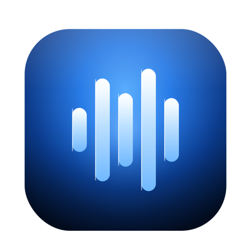

<p align="center">
  
</p>

# Roger

Speak. It types. Anywhere on your Mac.

Roger lives in your menu bar and turns your voice into text — in any app. Hold a hotkey, say what you need and it appears at your cursor. No cloud. No latency. Just your voice and Apple Silicon.

**Your voice stays on your machine.** Speech recognition runs entirely on-device using the Neural Engine. Cloud AI is available for text cleanup but always opt-in.

[](https://ko-fi.com/V7V31T6CL9)

## Features

- **Works everywhere** — Notes, Warp, VS Code, Slack, browsers — if it has a cursor, Roger can type into it
- **Completely private** — Powered by [WhisperKit](https://github.com/argmaxinc/WhisperKit) on Apple Silicon. Your audio never leaves your Mac
- **Speaks your language** — English and German with automatic detection. More languages via Whisper's multilingual models
- **Cleans up after you** — Removes filler words, fixes punctuation and grammar. Choose from built-in presets or create your own
- **Your rules** — Pick from Plain, Polished, Professional or Code presets. Or build a custom one with your own AI prompt and dictionary
- **Bring your own AI** — Apple Intelligence, Ollama, Claude or OpenAI for post-processing. Local-first, cloud if you want it
- **Caps Lock push-to-talk** — Hold to record, release to transcribe. Or toggle mode if you prefer
- **Stays out of the way** — Menu bar only, no Dock icon. A subtle floating indicator shows when you're recording

## Installation

### Homebrew (recommended)

```bash
brew tap jordiboehme/tap
brew install --cask roger
```

### Download

Grab the latest DMG from [GitHub Releases](https://github.com/jordiboehme/roger/releases), open it and drag Roger to Applications.

### Build from Source

```bash
git clone https://github.com/jordiboehme/roger.git
cd roger
xcodebuild -project Roger/Roger.xcodeproj -scheme Roger -configuration Release build CONFIGURATION_BUILD_DIR=build
```

Then move `build/Roger.app` to `/Applications` and launch it.

## Requirements

- **macOS 14 Sonoma** or later
- **Microphone permission** (prompted on first launch)
- **Accessibility permission** (for text insertion and global hotkey)

## How It Works

Roger captures audio, transcribes it on-device using [WhisperKit](https://github.com/argmaxinc/WhisperKit) (a CoreML port of [OpenAI Whisper](https://github.com/openai/whisper)), optionally cleans up the text with an AI provider and inserts the result at your cursor. It uses the Accessibility API for direct insertion with a clipboard+paste fallback for Electron apps.

### Presets

| Preset | What it does |
|--------|-------------|
| **Plain** | Strips filler words and repeated words. No AI needed. |
| **Polished** | Adds punctuation, capitalization and formatting. |
| **Professional** | Full cleanup with an AI rewrite for send-ready prose. |
| **Code** | Preserves technical terms, function names and code references. |
| **Custom** | Your own pipeline — choose which steps run, write your own prompt. |

### AI Providers

| Provider | Type | Notes |
|----------|------|-------|
| **Apple Intelligence** | Local | On-device, macOS 26+, zero setup |
| **Ollama** | Local | Your Mac, your NAS, your homelab |
| **Claude** | Cloud | Anthropic API |
| **OpenAI** | Cloud | OpenAI API |

## Privacy

Roger is built around a simple principle: your voice is yours.

- **Speech recognition** is 100% on-device. Audio never leaves your Mac.
- **Local AI** (Apple Intelligence, Ollama) keeps your text on your machine too.
- **Cloud providers** are opt-in and clearly marked. Your text is sent to their servers only if you choose to.

## License

MIT License — See [LICENSE](LICENSE) for details.
